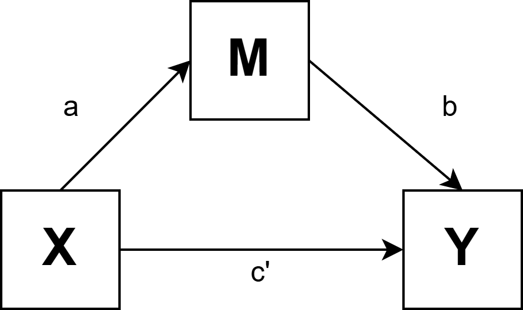
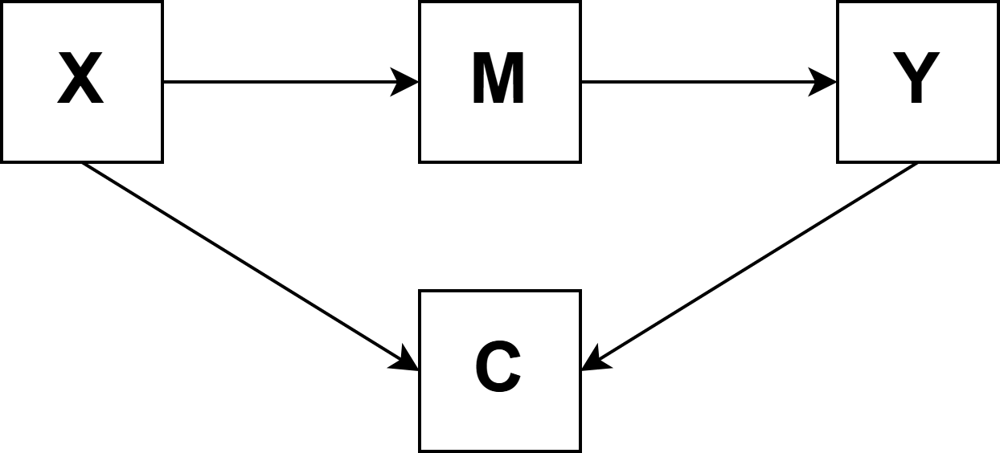

## _Outline_

* Apa itu mediasi?
* Model mediasi sederhana
* Pendekatan: kausalitas *a la* Baron & Kenny vs *bootstrapping*
* Implementasi di jamovi (medmod)
* Interpretasi *indirect effect*
* ⚠️**Peringatan**⚠️: mediasi dari data *cross-sectional*
* *Collider bias*

# Apa itu mediasi? {background-color="#14497F"}

## Mediasi: "bagaimana" dan "mengapa"

Mediasi menjelaskan **mekanisme** di balik hubungan antara dua variabel — *bagaimana* atau *mengapa* variabel X memengaruhi variabel Y.

**Contoh:** Mengapa status sosial-ekonomi (X) berhubungan dengan prestasi akademik (Y)?

* Mungkin karena SES yang lebih tinggi → akses lebih baik ke sumber belajar (M) → prestasi lebih baik (Y)
* Variabel **M** (akses sumber belajar) adalah **mediator**

::: {.callout-note}
#### Mediasi berbeda dari moderasi
**Mediasi** menjelaskan *mekanisme* hubungan X → Y. **Moderasi** menjelaskan *kondisi* di mana hubungan X → Y lebih kuat atau lebih lemah. Keduanya sering dikombinasikan dalam model *moderated mediation* atau *mediated moderation*.
:::

## Model mediasi sederhana (*simple mediation*)

:::: {.columns}
::: {.column width="60%"}
Dalam model mediasi sederhana, terdapat tiga variabel:

* **X**: variabel independen (prediktor)
* **M**: mediator
* **Y**: variabel dependen (hasil)

Dan tiga jalur (*path*) utama:

* **Jalur a**: X → M
* **Jalur b**: M → Y (mengontrol X)
* **Jalur c'** (*c-prime*): X → Y mengontrol M (*direct effect*)
:::
::: {.column width="40%"}

{fig-align="center"}

*Total effect* c = c' + (a × b)
:::
::::

**Efek tidak langsung (*indirect effect*)**: $a \times b$

Ini adalah besaran efek X pada Y yang **dimediasi** melalui M.

# Pendekatan analisis mediasi {background-color="#14497F"}

## Baron & Kenny (1986): pendekatan klasik

Metode klasik Baron & Kenny menetapkan empat syarat untuk klaim mediasi:

1. X secara signifikan memprediksi Y (*total effect* signifikan)
2. X secara signifikan memprediksi M (*path a* signifikan)
3. M secara signifikan memprediksi Y mengontrol X (*path b* signifikan)
4. Ketika M dimasukkan ke model, efek X pada Y berkurang (*mediasi parsial*) atau hilang (*mediasi penuh*)

::: {.callout-important}
#### Pendekatan Baron & Kenny sudah usang dan tidak direkomendasikan lagi.**

Syarat (1) tidak perlu dipenuhi — *indirect effect* bisa ada tanpa *total effect* yang signifikan (terutama jika ada mediator berganda dengan arah berlawanan). Uji Sobel (untuk signifikansi *indirect effect*) juga mengasumsikan normalitas yang sering dilanggar. Gunakan ***bootstrapping*** sebagai gantinya.
:::

## *Bootstrapping*: pendekatan modern

*Bootstrapping* adalah metode resampling yang mengestimasi distribusi *indirect effect* (a×b) **langsung dari data**, tanpa mengasumsikan distribusi normal.

**Cara kerjanya:**

1. Ambil sampel berulang (*bootstrap samples*) dari data asli **dengan pengembalian** — biasanya 5.000 atau 10.000 kali
2. Hitung *indirect effect* (a×b) untuk setiap sampel
3. Gunakan distribusi 5.000 nilai a×b untuk membangun ***bootstrap confidence interval*** untuk *indirect effect*

Ada beberapa jenis *bootstrap CI*: **persentil CI** (paling sederhana), **BC-CI** (*bias-corrected*), dan **BCa-CI** (*bias-corrected and accelerated*). `medmod` di `jamovi` menggunakan **persentil CI** secara *default*.

::: {.callout-tip}
#### Interpretasi *bootstrapped* CI
**Jika 95% *bootstrap* persentil CI untuk *indirect effect* tidak mencakup nol**, kita memiliki bukti bahwa *indirect effect* secara statistik berbeda dari nol — tanpa perlu mengasumsikan normalitas. Ini adalah cara yang direkomendasikan untuk menguji signifikansi mediasi.
:::

# Implementasi di `jamovi` (`medmod`) {background-color="#14497F"}

## Memasang modul `medmod` di `jamovi`

`medmod` adalah modul `jamovi` untuk analisis mediasi dan moderasi berbasis *bootstrapping*.

**Instalasi:**

1. Di `jamovi`, klik ikon **+** (modul) di pojok kanan atas
2. Cari `medmod` di *jamovi library*, lalu klik *Install*
3. Setelah terpasang, modul `medmod` akan muncul di menu utama jamovi

::: {.callout-note}
Jika modul `medmod` tidak tersedia, analisis mediasi bisa dilakukan secara manual melalui regresi bertingkat: (1) regresikan M pada X, (2) regresikan Y pada X dan M, kemudian hitung *indirect effect* = koefisien jalur a × koefisien jalur b.
:::

## Contoh: stres, dukungan sosial, dan *wellbeing*

Hipotesis: Beban akademik yang tinggi (X = **beban**) menurunkan *wellbeing* (Y = **wellbeing**) **karena** mengurangi persepsi dukungan sosial (M = **dukungan_sosial**).

Dataset: **mediasi_akademik.omv** (N = 500 mahasiswa)

**Langkah di jamovi (medmod):**

1. Klik menu *medmod*  *Mediation Analysis*
2. Masukkan variabel:
   - *Predictor* (X): **beban**
   - *Mediator* (M): **dukungan_sosial**
   - *Outcome* (Y): **wellbeing**
3. Di opsi *Estimation*, centang ***Bootstrap CI*** dan set *Bootstrap samples* = 5000
4. Centang *Indirect effect*, *Direct effect*, *Total effect*

## Membaca *output* mediasi

**Ringkasan hasil yang diharapkan:**

| Efek | Koefisien | 95% *Bootstrap* CI (persentil) | Signifikan? |
|---|---|---|---|
| *Total effect* (c) | −0.42 | [−0.49, −0.36] | Ya |
| *Direct effect* (c') | −0.16 | [−0.23, −0.09] | Ya |
| ***Indirect effect* (a×b)** | **−0.26** | **[−0.31, −0.21]** | **Ya** |

Interpretasi: Beban akademik menurunkan *wellbeing* (total *c* = −0.42). Sebagian efek ini dimediasi **melalui** berkurangnya dukungan sosial yang dipersepsi (*indirect* a×b = −0.26, 95% CI tidak mencakup nol). Namun masih ada *direct effect* yang signifikan (c' = −0.16), menunjukkan **mediasi parsial**.

# Interpretasi indirect effect {background-color="#14497F"}

## Proporsi mediasi

Selain signifikansi, kita juga bisa menghitung **proporsi** total efek yang dimediasi:

$$\text{Proporsi mediasi} = \frac{a \times b}{c} = \frac{-0.26}{-0.42} \approx 0.61$$

Artinya, sekitar **61%** dari efek beban akademik pada *wellbeing* bekerja melalui mekanisme dukungan sosial.

::: {.callout-note}
Proporsi mediasi bisa melebihi 1 atau bernilai negatif (disebut *inconsistent mediation*) jika *direct effect* dan *indirect effect* berlawanan arah. Dalam kasus seperti ini, interpretasinya lebih kompleks.
:::

***Effect size* untuk mediasi:**

$$\kappa^2 = \frac{a \times b}{\text{varians maksimal a×b yang mungkin}}$$

Nilai $\kappa^2$ antara 0–1. Konvensi: 0.01 kecil, 0.09 sedang, 0.25 besar (Preacher & Kelley, 2011). Pada contoh di atas, jamovi melaporkan $\kappa^2 \approx 0.18$ — termasuk efek **sedang** mendekati besar.

# ⚠️Peringatan⚠️: mediasi dan kausalitas {background-color="#14497F"}

## Data *cross-sectional* dan klaim kausalitas

::: {.callout-important}
#### Analisis mediasi dari data *cross-sectional* tidak bisa membuktikan kausalitas

Dalam mediasi, kita mengklaim: X *menyebabkan* M, dan M *menyebabkan* Y. Ini adalah klaim **kausal** yang kuat. Namun data *cross-sectional* hanya mengukur semua variabel **pada satu titik waktu yang sama** — tidak ada cara untuk menetapkan *temporal ordering*/urut-urutan kejadian (apa yang terjadi lebih dulu?).
:::

**Masalah spesifik dengan mediasi *cross-sectional*:**

1. **Urutan waktu tidak jelas**: apakah X benar-benar terjadi sebelum M, dan M sebelum Y?
2. ***Reverse causation***: mungkin Y → M → X, atau M → X → Y
3. ***Confounding***: variabel ketiga yang tidak diukur bisa menyebabkan ketiganya sekaligus

## Contoh masalah *temporal ordering*

Kembali ke contoh beban akademik → dukungan sosial → *wellbeing*:

Kita ukur ketiga variabel dalam satu survei pada hari yang sama. Mungkin saja:

* Mahasiswa dengan *wellbeing* yang rendah **lebih cenderung** merasakan beban sebagai berat dan dukungan sebagai kurang (*Y* memengaruhi persepsi terhadap X dan M)
* Dukungan sosial yang rendah *menyebabkan* mahasiswa mengambil lebih banyak mata kuliah untuk "mengisi waktu" (M → X, bukan X → M)

::: {.callout-note}
#### Lalu bagaimana cara menguji mediasi?
Pengujian mediasi yang lebih baik membutuhkan desain **longitudinal** (X diukur sebelum M, M diukur sebelum Y) atau, yang terbaik, melalui **eksperimen** di mana X (dan M) dimanipulasi secara acak dan efeknya pada M dan Y diamati sepanjang waktu.

Meskipun, pengujian secara longitudinal hanya bisa mengendalikan *confounding* yang *time-invariant* saja. Apabila variabel *cofounding* berubah sepanjang waktu, maka desain *longitudinal* tidak bisa mengendalikan efek *confounding*.
:::

## Kapan mediasi *cross-sectional* masih berguna?

Meski terbatas secara kausal, analisis mediasi *cross-sectional* mungkin bisa bermakna jika:

* Digunakan untuk **mengeksplorasi mekanisme** yang akan diuji lebih lanjut dengan desain yang lebih kuat
* Dikombinasikan dengan argumen teoritis yang kuat tentang urutan temporal
* Variabel X adalah **atribut stabil** atau manipulasi eksperimental (bukan variabel yang berfluktuasi)
* Disajikan dengan **language yang jujur** — "konsisten dengan mediasi" bukan "membuktikan mediasi"

::: {.callout-tip}
#### Cara yang disarankan untuk melaporkan mediasi *cross-sectional*:

*"Hasil analisis bootstrapping menunjukkan indirect effect yang signifikan (a×b = −0.26, 95% *bootstrap* persentil CI [−0.31, −0.21]), yang artinya ditemukan pola yang konsisten dengan model mediasi, di mana dukungan sosial mungkin memediasi hubungan antara beban akademik dan wellbeing. Namun, mengingat desain cross-sectional, interpretasi kausalitas tidak dapat dilakukan."*
:::

# Collider bias {background-color="#14497F"}

## Apa itu *collider*?

**Collider** adalah variabel yang menerima panah dari **dua variabel lain sekaligus** dalam model kita.

{fig-align="center"}

Variabel **C** adalah *collider* karena dipengaruhi oleh X **dan** Y.

::: {.callout-important}
#### Masalah:
Jika kita mengontrol *collider*, misalnya memasukkannya ke regresi, atau memilih sampel berdasarkan nilai C tertentu, kita secara tidak sengaja **menciptakan** hubungan palsu antara X dan Y, meskipun keduanya tidak benar-benar berhubungan.
:::

**Contoh:** Apakah kecerdasan berkorelasi negatif dengan kerja keras di kalangan mahasiswa universitas bergengsi?

* Masuk universitas bergengsi (C) dipengaruhi oleh **kecerdasan** (X) dan **kerja keras** (Y)
* Ketika kita hanya mengamati mahasiswa di sana, kita tanpa sadar **mengontrol C**
* Hasilnya: mahasiswa yang sangat cerdas *tampak* kurang pekerja keras — padahal di populasi umum tidak demikian

## *Collider bias* dalam analisis mediasi

Dalam konteks mediasi, *collider bias* muncul ketika ada variabel yang **dipengaruhi oleh X dan M** (atau M dan Y) lalu kita masukkan ke model sebagai kontrol.

{fig-align="center"}

Mengontrol C di sini akan **merusak** estimasi jalur b (M → Y) dan *indirect effect*.

::: {.callout-tip}
#### Ingat 
Hati-hati dengan variabel kontrol yang "masuk akal" secara substantif. Sebelum menambahkan variabel kontrol ke model mediasi, tanyakan: *"Apakah variabel ini bisa dipengaruhi oleh X atau M?"* Jika ya, jangan dikontrol, justru akan menyebabkan *collider bias*.
:::

::: {.callout-note}
*Collider bias* adalah salah satu alasan mengapa analisis mediasi memerlukan **teori kausal yang eksplisit** (misalnya melalui [DAG — *Directed Acyclic Graph*](https://en.wikipedia.org/wiki/Directed_acyclic_graph)), bukan sekadar menambahkan variabel kontrol secara asal-asalan.
:::

## Latihan: analisis mediasi di jamovi

Buka dataset [**mediasi_akademik.omv**](/docs/materials/mediasi_akademik.omv), kemudian uji apakah dukungan sosial memediasi hubungan antara beban akademik dan *wellbeing*:

1. Inspeksi terlebih dahulu: buat *scatterplot* untuk pasangan **beban–dukungan_sosial** dan **dukungan_sosial–wellbeing**
2. Jalankan mediasi dengan *bootstrap* CI (5.000 sampel)
3. Bandingkan *total effect*, *direct effect*, dan *indirect effect*
4. Hitung proporsi mediasi secara manual: (a×b) / c

Pertanyaan untuk didiskusikan:

* Seandainya ini adalah data longitudinal (X diukur 3 bulan sebelum M dan Y), apa yang berubah dalam cara kalian menginterpretasi hasilnya?
* Adakah variabel ketiga yang mungkin menjadi *confounder* dalam hubungan ini?
* Bagaimana kalian akan mendesain studi eksperimental untuk menguji klaim mediasi ini?

## Ada pertanyaan❓

{fig-align="center"}

::: {.callout-note}
* Paparan disusun dengan menggunakan <i class="fa-brands fa-r-project"></i> dan [**Quarto**](https://quarto.org) dengan _template_ dari [UNAIR Theme](https://github.com/rameliaz/quarto-unair-theme).
* Kontak saya via <i class="fas fa-paper-plane"></i> <a href="mailto:amelia.zein@psikologi.unair.ac.id">amelia.zein@psikologi.unair.ac.id</a>
:::