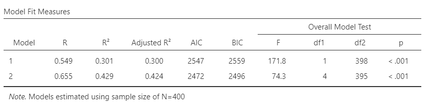
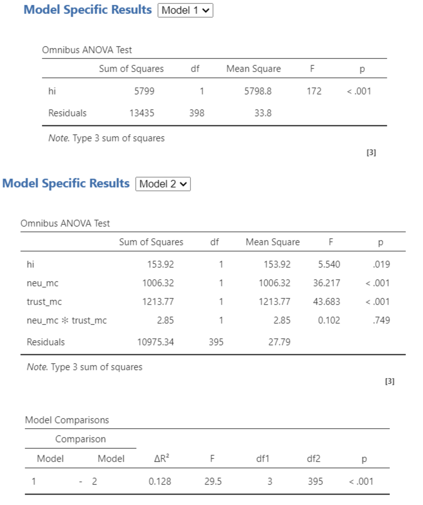
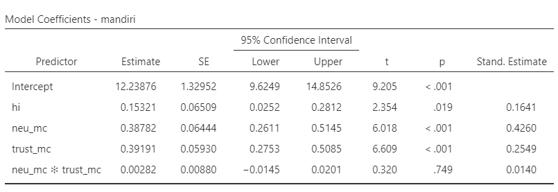
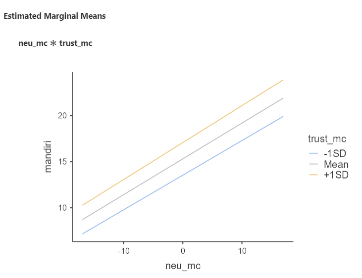
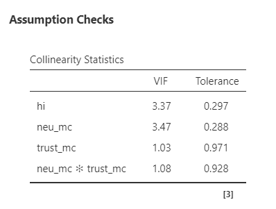

## _Outline_

* Konsep moderasi: apa dan kapan relevan?
* Pendekatan 1: suku interaksi dalam regresi OLS
  - _Mean-centering_ prediktor
  - Latihan: `dataset-sekolah.omv`
  - Interpretasi _simple slopes_ dan _estimated marginal means_
  - Diagnostik kolinearitas
  - Pelaporan hasil
* Pendekatan 2: modul `medmod` di `jamovi` (berbasis `lavaan`)
  - Perbedaan konseptual OLS vs. `medmod`
  - Efek kondisional dan Johnson-Neyman (_floodlight_)
  - Latihan: `dataset-sekolah.omv` dengan `medmod`
  - Pelaporan hasil
* Latihan mandiri

# Apa itu Moderasi? {background-color="#14497F" .center}

## Moderasi: efek yang bergantung pada konteks

**Moderasi** terjadi ketika **kekuatan atau arah** hubungan antara X dan Y **bergantung pada nilai variabel ketiga (M, moderator)**.

:::: {.columns}
::: {.column width="55%"}

**Persamaan umum:**

$$Y = b_0 + b_1 X + b_2 M + b_3 (X \times M) + \varepsilon$$

* $b_1$ = _main effect_ X (pada M = rata-rata)
* $b_2$ = _main effect_ M (pada X = rata-rata)
* $b_3$ = koefisien interaksi → **uji moderasi**
* Jika $b_3$ signifikan → efek X terhadap Y **berbeda** tergantung nilai M

:::
::: {.column width="45%"}

**Diagram:**

```
X ───────────────→ Y
         ↑
         M (moderator)
```

M **bukan** mediator (tidak berada di jalur X → M → Y). M **mengubah kekuatan atau arah** panah X → Y.

:::
::::

## Kapan moderasi relevan?

::: {.incremental}

* **"Tergantung..."** dalam kalimat penjelasan — sinyal moderasi mungkin terjadi
  - "_Neuroticism_ ibu berpengaruh terhadap kemandirian anak, **tapi tergantung** seberapa besar ia mempercayai perkembangan natural anak."
  - "Efek beban kerja terhadap _burnout_ **berbeda** tergantung tingkat dukungan sosial."

* Moderasi menjawab pertanyaan **"untuk siapa?"** atau **"dalam kondisi apa?"** suatu efek berlaku

* **Moderasi ≠ mediasi**
  - Mediasi menjawab: "melalui jalur apa?" — X → M → Y
  - Moderasi menjawab: "seberapa kuat?" — M mengubah panah X → Y
  - Keduanya sering dikacaukan, padahal secara konseptual sangat berbeda!

:::

# Pendekatan 1: OLS dengan Suku Interaksi {background-color="#14497F" .center}

## Regresi dengan suku interaksi (_interaction terms_)

Ada 2️⃣ hal yang diestimasi:

**_Main effect_**

* Efek langsung satu prediktor terhadap _outcome_, dengan prediktor lain di-_hold constant_ pada rata-ratanya (setelah _centering_)
* Contoh: ketika _main effect_ _neuroticism_ (_b_) = 0.31, artinya efek _neuroticism_ terhadap kemandirian **ketika _trust_  = rata-rata**

**_Interaction effect_**

* Seberapa besar efek X~1~ terhadap _outcome_ **berubah** setiap satu unit perubahan X~2~
* Jika signifikan → hubungan antara X~1~ dan _outcome_ tidak konstan; berbeda-beda tergantung nilai X~2~

## _Mean-centering_ pada suku interaksi (_interaction terms_)

::: {.incremental}

* Ketika melakukan analisis regresi dengan suku interaksi, prediktor dan moderator perlu di-_centering_ terlebih dahulu.

* Alasannya, koefisien _main effect_ akan lebih mudah diinterpretasi:
  - Tanpa _centering_, koefisien X~1~ adalah efek X~1~ ketika X~2~ = 0 — sering tidak bermakna substantif
  - Dengan _centering_, koefisien X~1~ adalah efek X~1~ ketika X~2~ berada di **rata-ratanya**

* Selain itu, _centering_ mengurangi multikolinearitas artifisial antara prediktor dan suku interaksi:
  - Tanpa _centering_, variabel interaksi (X~1~ × X~2~) sangat berkorelasi dengan X~1~ dan X~2~ secara terpisah
  - _Centering_ mengurangi **korelasi artifisial** ini, bukan multikolinearitas substantif

:::

## Latihan 1️⃣ — OLS dengan suku interaksi

Kita lanjutkan kasus Marimar. Hipotesis barunya:

> "Efek _neuroticism_ ibu terhadap kemandirian anak **dimoderasi** oleh kepercayaan ibu pada perkembangan natural anak (_trust in organismic development_)."

Gunakan [`dataset-sekolah.omv`](https://rameliaz.github.io/mlm-lme-workshop/dataset-sekolah.omv)

**Langkah-langkah di `jamovi` — Regression → Linear Regression:**

* Pada **model builder**, klik **add new block**
  - **Block 1**: masukkan **hi**
  - **Block 2**: sambil menekan `ctrl`, klik **neu_mc** lalu **trust_mc** → klik tanda panah kedua → **interaction**; masukkan juga **neu_mc** dan **trust_mc** sebagai _main effects_
* Centang **collinearity statistics** di **assumption checks**
* Centang **AIC** dan **BIC** di **model fit**
* Masukkan **neu_mc** dan **trust_mc** di **estimated marginal means → terms 1**

## Model fit

{fig-align="center"}

Model 2 (_F_(2,397) = 74.3, _p_ = .001, _Adj. R_^2^ = .424) dapat menjelaskan varians tingkat kemandirian anak lebih baik daripada Model 1 (_F_(1,398) = 171.8, _p_ = .001, _R_^2^ = .300), dengan _overlapping variances_ sebesar 42.4% dibanding 30%.

**_Information criteria_ (AIC & BIC)**

* Memberikan "penalti" pada model yang mengandung lebih banyak prediktor — mengatasi kelemahan R^2^ yang terus naik seiring ditambahnya prediktor
* Pilih model dengan AIC dan BIC terkecil (Model 2)

## _Model comparison_

:::: {.columns}
::: {.column width="55%"}

Ketika dibandingkan, Model 1 dan Model 2 berbeda signifikan (_F_(1,397) = 29.5, _p_ = .001). ΔR^2^ = .128, artinya penambahan suku interaksi meningkatkan kemampuan model menjelaskan varians sebesar 12.8%.

**Coba perhatikan Residuals Model 1 dengan Model 2**

:::
::: {.column width="45%"}

{fig-align="center"}

:::
::::

## Koefisien model 2

{fig-align="center"}

Pendapatan keluarga dapat menjelaskan variasi kemandirian anak (_B_ = 0.153 95% CI [0.025, 0.281], _SE_ = 0.065, _t_ = 2.354, _p_ = .019).

_Main effect neuroticism_ (_B_ = 0.387 95% CI [0.261, 0.514], _SE_ = 0.064, _t_ = 6.018, _p_ = .001) dan _trust in organismic development_ (_B_ = 0.391 95% CI [0.275, 0.508], _SE_ = 0.059, _t_ = 6.609, _p_ = .001) secara independen menjelaskan tingkat kemandirian anak.

Tidak ada bukti bahwa ada interaksi antara _neuroticism_ dengan _trust in organismic development_ dalam menjelaskan varians kemandirian anak (_B_ = -0.005 95% CI [-0.019, 0.018], _SE_ = 0.009, _t_ = -0.05, _p_ = .955).

## _Estimated Marginal Means_

:::: {.columns}
::: {.column}

* Interpretasi _slopes_ pada suku interaksi — bisa di-_probe_ dengan _estimated marginal means_
  - Dalam kasus ini, suku interaksi **nonsignifikan**: dua garis regresi sejajar, tidak berpotongan
  - Artinya, masing-masing prediktor berkontribusi menjelaskan varians _outcome_ secara **independen**

:::
::: {.column}

{fig-align="center"}

:::
::::

## _Estimated Marginal Means_

**Seandainya** suku interaksi signifikan, lihat tanda _slope_-nya:

* _B_ interaksi **positif** → pada ibu dengan _trust_ tinggi (+1SD), hubungan _neuroticism_–kemandirian semakin **menguat**
* _B_ interaksi **negatif** → pada ibu dengan _trust_ tinggi (+1SD), hubungan _neuroticism_–kemandirian semakin **melemah**

::: {.callout-tip}
#### Visualisasi interaksi
Garis regresi yang **berpotongan** (_crossed_) menunjukkan interaksi **dis**ordinal (arah efek berbalik di titik persilangan). Garis yang **menyebar tanpa berpotongan** (_divergent_) menunjukkan interaksi **ordinal** (arah efek sama, hanya kekuatannya berbeda).
:::

## Diagnostik kolinearitas

:::: {.columns}
::: {.column}

* Dapat dideteksi dengan _variance inflated factors_ (VIF)
  - VIF < 5 → multikolinearitas tidak terjadi
* Penelitian _longitudinal_ punya potensi autokorelasi (residual _time 1_ dan _time 2_ berkorelasi)
  - Dicek dengan statistik Durbin-Watson (DW), yang berkisar antara 0–4
  - DW ≈ 2 → tidak ada autokorelasi; DW < 2 → autokorelasi positif; DW > 2 → autokorelasi negatif
  - Aturan praktis: DW antara 1.5–2.5 umumnya dianggap tidak bermasalah
  - Untuk data _cross-sectional_, autokorelasi umumnya tidak relevan

:::
::: {.column}

{fig-align="center"}

:::
::::

## Melaporkan hasil OLS dengan suku interaksi 1️⃣

> Untuk menginvestigasi keterkaitan antara pendapatan keluarga, kecenderungan _neuroticism_ ibu, dan kepercayaan ibu bahwa perkembangan anak dapat terjadi secara natural dengan tingkat kemandirian anak, peneliti melakukan analisis regresi linear hirarkial dengan _interaction terms_. Peneliti menyusun dua model: model 1 mengestimasi varians tingkat kemandirian anak dengan pendapatan keluarga inti sebagai prediktor, sedangkan pada model 2 peneliti menambahkan _interaction terms_ antara _neuroticism_ dengan _trust_.

> Ketika dibandingkan, Model 1 dan Model 2 berbeda signifikan (_F_(1,397) = 29.5, _p_ = .001). Model 2 (_F_(2,397) = 74.3, _p_ = .001, _Adj. R_^2^ = .424, AIC = 2472, BIC = 2496) menjelaskan varians tingkat kemandirian anak lebih baik daripada Model 1 (_F_(1,398) = 171.8, _p_ = .001, _Adj. R_^2^ = .300, AIC = 2547, BIC = 2559), dengan ΔR^2^ = .128.

## Melaporkan hasil OLS dengan suku interaksi 2️⃣

> Pendapatan keluarga dapat menjelaskan variasi kemandirian anak (_B_ = 0.153 95% CI [0.025, 0.281], _SE_ = 0.065, _t_ = 2.354, _p_ = .019). _Main effect neuroticism_ (_B_ = 0.387 95% CI [0.261, 0.514], _SE_ = 0.064, _t_ = 6.018, _p_ = .001) dan _trust in organismic development_ (_B_ = 0.391 95% CI [0.275, 0.508], _SE_ = 0.059, _t_ = 6.609, _p_ = .001) secara independen menjelaskan tingkat kemandirian anak. Tidak ada bukti bahwa interaksi antara _neuroticism_ dengan _trust in organismic development_ dapat menjelaskan varians kemandirian anak (_B_ = -0.005 95% CI [-0.019, 0.018], _SE_ = 0.009, _t_ = -0.05, _p_ = .955).

> Potensi multikolinearitas dideteksi dengan VIF dan hasil analisis menunjukkan multikolinearitas kemungkinan tidak terjadi (VIF = 1.03–3.47).

# Pendekatan 2: Analisis Moderasi dengan `medmod` {background-color="#14497F" .center}

## Apa itu `medmod`?

`medmod` adalah modul `jamovi` yang dirancang untuk:

* Analisis **moderasi** (_moderation_, MOD)
* Analisis **mediasi** (_mediation_, MED)
* Analisis **moderasi-mediasi** (_moderated mediation_) — setara dengan Hayes PROCESS Macro

::: {.callout-note}
#### Di balik layar: `lavaan`
`medmod` menggunakan paket R **`lavaan`** (_latent variable analysis_) — _framework_ SEM yang digunakan luas dalam penelitian psikologi. Ini berarti estimasinya menggunakan **Maximum Likelihood (ML)**, bukan _Ordinary Least Squares_.
:::

* Dikembangkan oleh [Marcello Gallucci](https://www.pagelysis.com/) (Università degli Studi di Milano-Bicocca)
* Dapat diinstal langsung dari `jamovi` → klik ikon **⊕** (pojok kanan atas) → cari **medmod** → **Install**

## OLS _interaction terms_ vs. `medmod`: apa bedanya?

| Aspek | OLS + _Interaction Terms_ | `medmod` (berbasis `lavaan`) |
|-------|:------------------------:|:----------------------------:|
| **Metode estimasi** | _Least squares_ | _Maximum likelihood_ |
| **CI untuk interaksi** | Berbasis distribusi-_t_ (asimtotik) | _Bootstrap_ (non-parametrik) |
| **_Centering_** | Harus manual | Opsi otomatis |
| **Efek kondisional** | EMM — konfigurasi manual | Otomatis (−1SD, rerata, +1SD) |
| **Johnson-Neyman** | ✗ Tidak tersedia | ✓ Tersedia (_floodlight_) |
| **Visualisasi** | _Estimated marginal means_ | _Simple slopes plot_ otomatis |
| **_Framework_ model** | Satu persamaan regresi | _Path model_ (SEM) |
| **Ekstensi ke mediasi** | ✗ Tidak langsung | ✓ Moderated mediation (MEDMOD) |

: {tbl-colwidths="[28,36,36]"}

## Perbedaan inferensi: distribusi-_t_ vs. _bootstrap_

:::: {.columns}
::: {.column width="50%"}

**OLS — distribusi-_t_ (asimtotik)**

* Berasumsi distribusi normal untuk _standard errors_
* Akurat ketika asumsi terpenuhi dan N besar
* Rentan terhadap pelanggaran normalitas residual
* Kurang akurat untuk koefisien interaksi yang distribusinya _skewed_

:::
::: {.column width="50%"}

**`medmod` — _Bootstrap_ CI**

* Tidak berasumsi distribusi tertentu untuk SE
* Mengambil ulang sampel ribuan kali (default: 1.000×)
* Lebih akurat untuk efek interaksi
* Direkomendasikan Hayes (2013) dan Preacher & Hayes (2008)

:::
::::

::: {.callout-tip}
#### Mengapa _bootstrap_ CI lebih baik untuk interaksi?
Koefisien interaksi merupakan **hasil kali dua estimasi**. Distribusi hasil kali dua koefisien cenderung _non-normal_, sehingga CI berbasis distribusi-_t_ bisa tidak akurat — khususnya pada sampel kecil atau data yang tidak normal.
:::

## Kapan memilih OLS, kapan `medmod`?

:::: {.columns}
::: {.column width="50%"}

**✅ Pilih OLS + _interaction terms_** jika:

* Hanya menguji satu moderasi sederhana
* Ingin membandingkan model hirarkial (ΔR², AIC/BIC)
* Distribusi residual memenuhi asumsi OLS
* Interpretasi B dan F-test sudah cukup

:::
::: {.column width="50%"}

**✅ Pilih `medmod`** jika:

* Butuh _bootstrap_ CI yang lebih robust
* Ingin visualisasi _simple slopes_ otomatis
* Butuh analisis Johnson-Neyman (_floodlight_)
* Rencana memperluas ke mediasi atau MEDMOD
* Distribusi tidak normal atau sampel relatif kecil

:::
::::

::: {.callout-warning}
#### Hindari analisis ganda tanpa justifikasi
Jangan menjalankan OLS dan `medmod` lalu melaporkan yang hasilnya "lebih signifikan". Pilih pendekatan **sebelum** melihat data, berdasarkan pertanyaan penelitian dan karakteristik data.
:::

## Latihan 2️⃣ — Moderasi dengan `medmod`

Gunakan dataset yang sama: [`dataset-sekolah.omv`](https://rameliaz.github.io/mlm-lme-workshop/dataset-sekolah.omv)

**Pertanyaan penelitian:** Apakah _trust in organismic development_ memoderasi hubungan antara _neuroticism_ ibu dan kemandirian anak?

**Langkah-langkah di `jamovi` — medmod → MOD:**

1. Masukkan **mandiri** ke **Dependent Variable (Y)**
2. Masukkan **neu** ke **Independent Variable (X)**
3. Masukkan **trust** ke **Moderator (M)**
4. Di bagian **Covariates**, tambahkan **hi**
5. Di **Inferential options**: centang **Bootstrap CI**, gunakan default 1.000 _resample_
6. Di **Plots**: centang **Simple slopes plot**
7. Di **Johnson-Neyman**: centang untuk mengaktifkan _floodlight analysis_

## Output `medmod`: _Model Fit_ dan koefisien interaksi

:::: {.columns}
::: {.column width="55%"}

`medmod` melaporkan:

* **R²** — proporsi varians yang dijelaskan
* **F-test** — uji signifikansi model keseluruhan
* **Koefisien interaksi** (X × M) — inilah uji moderasi

::: {.callout-note}
#### Interpretasi koefisien interaksi
* **Signifikan** → moderasi terbukti; efek X terhadap Y berubah tergantung nilai M
* **Tidak signifikan** → tidak ada bukti moderasi; efek X terhadap Y konstan di semua nilai M
:::

:::
::: {.column width="45%"}

**Perbandingan _output_ OLS vs. `medmod`:**

| Output | OLS | `medmod` |
|--------|:---:|:--------:|
| R², F-test | ✓ | ✓ |
| _B_, SE, _p_ | ✓ | ✓ |
| Bootstrap CI | ✗ | ✓ |
| Conditional effects | Partial | ✓ Full |
| JN plot | ✗ | ✓ |

: {tbl-colwidths="[40,30,30]"}

:::
::::

## Output `medmod`: _Conditional Effects_

**_Conditional effects_** menunjukkan efek X terhadap Y pada tiga nilai moderator (M):

| Nilai Moderator (_trust_) | _B_ | _SE_ | _t_ | _p_ | 95% _Bootstrap_ CI |
|--------------------------|:---:|:----:|:---:|:---:|--------------------|
| −1SD (percaya rendah) | — | — | — | — | [—, —] |
| Rata-rata | — | — | — | — | [—, —] |
| +1SD (percaya tinggi) | — | — | — | — | [—, —] |

: {tbl-colwidths="[30,8,8,8,8,38]"}

::: {.callout-tip}
#### Cara membaca _conditional effects_
* Efek X signifikan hanya pada **satu atau dua level** moderator → moderasi kondisional
* Efek X signifikan **di semua level** → efek konsisten, moderasi lemah atau tidak bermakna
* Perhatikan **arah dan besaran** _B_, bukan hanya signifikansinya — moderasi bisa bermakna substantif meski CI memotong nol
:::

## Output `medmod`: Johnson-Neyman (_Floodlight Analysis_)

**Pertanyaan:** Pada nilai moderator **berapa** efek X terhadap Y berubah dari tidak signifikan menjadi signifikan (atau sebaliknya)?

::: {.incremental}

* Disebut juga _floodlight analysis_ ([Spiller et al., 2013](https://doi.org/10.1086/664734))
* Menghindari batasan arbitrer "+1SD / −1SD" dari _simple slopes_ — menunjukkan **seluruh rentang** nilai moderator
* Titik transisi disebut "_regions of significance_" — nilai M di mana efek X melewati batas signifikansi
* `medmod` menghasilkan Johnson-Neyman plot secara otomatis

:::

::: {.callout-note}
#### Contoh interpretasi Johnson-Neyman
"Efek _neuroticism_ terhadap kemandirian anak signifikan ketika skor _trust_ berada di bawah X.XX (yaitu 42% sampel). Di atas nilai tersebut, efek _neuroticism_ tidak berbeda signifikan dari nol."
:::

## Melaporkan hasil analisis moderasi dengan `medmod`

> "Analisis moderasi dilakukan menggunakan modul `medmod` di `jamovi` (Gallucci, 2019) dengan estimasi _bootstrap_ (1.000 _resample_, _percentile CI_). Variabel _neuroticism_ ibu (X) dan _trust in organismic development_ (M) dimasukkan sebagai prediktor kemandirian anak (Y), dengan pendapatan keluarga sebagai kovariat.
>
> Model secara keseluruhan signifikan (_R_² = .\_, _F_(_df_) = \_, _p_ < .001). Koefisien interaksi antara _neuroticism_ dan _trust_ [tidak signifikan / signifikan] (_B_ = \_, 95% _bootstrap_ CI [\_, \_], _p_ = \_).

## Melaporkan hasil analisis moderasi dengan `medmod`

::: {.callout-tip}
#### Jika interaksi signifikan, tambahkan:
> "Efek kondisional _neuroticism_ terhadap kemandirian signifikan pada nilai _trust_ yang rendah (−1SD: _B_ = \_, 95% CI [\_, \_], _p_ < .05), namun tidak signifikan pada nilai rata-rata dan tinggi (+1SD), mengindikasikan bahwa efek _neuroticism_ melemah seiring meningkatnya kepercayaan ibu pada perkembangan natural anak. Analisis Johnson-Neyman menunjukkan bahwa efek _neuroticism_ signifikan ketika skor _trust_ < \_.\_\_ (\_% sampel)."
:::

::: {.callout-note}
#### Elemen wajib dalam pelaporan `medmod`
Selalu sebutkan: (1) metode estimasi (_bootstrap_), (2) jumlah _resample_, (3) jenis CI (_percentile_ atau BCa), (4) tiga level moderator yang digunakan.
:::

# Latihan Mandiri {background-color="#14497F" .center}

## Latihan mandiri

:::: {.columns}
::: {.column width="70%"}
Fernando Jose sebal sekali karena ia kembali kehilangan pengokotnya dan ini kali ketiga ia kehilangan pengokot yang baru dibelinya seminggu yang lalu.

Teman-teman kerjanya memang punya kebiasaan buruk meminjam barang tanpa seijinnya. Ia akhirnya bertanya, apa ya yang menyebabkan teman-temannya berperilaku seperti itu?

Akhirnya ia menduga, mungkin ada kaitannya dengan faktor kepribadian (_conscientiousness_) dan faktor situasional di tempat kerjanya.

Untuk faktor situasi, ia mengamati sepertinya persepsi atas kondisi kerja yang informal dan relasi formal antara senior-junior mungkin juga berkaitan dengan timbulnya perilaku tersebut.
:::

::: {.column width="30%"}

:::
::::
<!-- end columns -->

## Eksplorasi dataset

### Dataset: [dataset-organisasi.omv](https://rameliaz.github.io/mlm-lme-workshop/dataset-organisasi.omv)

* Fernando Jose akhirnya melakukan penelitian survei pada 450 karyawan di 3 perusahaan yang berbeda
* Dalam dataset tersebut ada beberapa variabel:
  - **con** = Kecenderungan _conscientiousness_ karyawan. Makin tinggi, karyawan lebih mungkin menunjukkan kehati-hatian, keteraturan, efisiensi, dan tanggung jawab.
  - **inf** = Persepsi atas nuansa informal dalam kantor. Makin tinggi, karyawan makin merasa situasi kantor lebih informal.
  - **pow** = Jarak kuasa (_power distance_). Makin tinggi, budaya senioritas makin kuat.
  - **incivil** = Intensitas perilaku tidak beradab. Makin besar, karyawan lebih mungkin berperilaku _emotionally abusive_, mengambil barang tanpa ijin, dan berperilaku tidak pantas.

## Tugas latihan mandiri

Susun hipotesis dan jalankan **dua** pendekatan analisis moderasi:

**Pendekatan A — OLS dengan suku interaksi:**

* Model 1: prediktor = jarak kuasa (**pow**)
* Model 2: tambahkan interaksi **con** × **inf** (beserta _main effects_-nya)
* Hitung ΔR², bandingkan AIC/BIC kedua model

**Pendekatan B — `medmod`:**

* X = **con**, M = **inf**, Y = **incivil**, kovariat = **pow**
* Aktifkan _bootstrap_ CI, _simple slopes plot_, dan Johnson-Neyman plot

**Pertanyaan diskusi:**

1. Apakah hasil OLS dan `medmod` konsisten? Mengapa bisa berbeda?
2. Informasi apa yang diberikan Johnson-Neyman yang tidak ada di OLS?
3. Mana yang lebih sesuai untuk dilaporkan dalam artikel ilmiah? Mengapa?

## Ada pertanyaan❓

{fig-align="center"}

::: {.callout-note}
* Paparan disusun dengan menggunakan <i class="fa-brands fa-r-project"></i> dan [**Quarto**](https://quarto.org) dengan _template_ dari [UNAIR Theme](https://github.com/rameliaz/quarto-unair-theme).
* Kontak saya via <i class="fas fa-paper-plane"></i> <a href="mailto:amelia.zein@psikologi.unair.ac.id">amelia.zein@psikologi.unair.ac.id</a>
:::
