## _Outline_

* Berlatih menginspeksi data secara visual dengan _scatterplot_
* Model regresi linear (_ordinary least square_)
* Menarik garis regresi (_fitted regression lines_)
* Varians yang dapat dan yang tidak dapat dijelaskan oleh model (_R_^2^)
* Menguji hipotesis
* Mengecek kecocokan model dengan data (_model fit_)
* Mengecek asumsi
  - Distribusi (normalitas) residual
  - Homoskedastisitas
* Mendeteksi _outliers_
* Menulis hasil analisis regresi linear dalam manuskrip

## Ilustrasi Kasus

:::: {.columns}
::: {.column width="70%"}
Marimar adalah seorang wali murid di sebuah PAUD di Kota Surabaya. Pada suatu hari, ia mengamati seorang anak (dan orangtua) yang perilakunya menarik perhatiannya.

Ibu anak tersebut bersikeras untuk menunggui anaknya di sekolah, padahal guru kelas meminta agar Ibu pulang saja, mempercayakan anak pada guru, dengan tujuan melatih kemandirian anaknya.

Melihat ibunya yang menggerutu karena diminta bu Guru pulang, si anak menangis meraung-raung tidak mau ditinggalkan. Akhirnya, terpaksa bu Guru membiarkan si Ibu menunggu di sekolah.

Marimar heran sekaligus penasaran, mengapa tiap anak **memberikan respon yang berbeda** ketika ditinggal orangtuanya di sekolah. Ada yang menangis meraung-raung, ada yang lebih santai dengan langsung bermain. Apakah ada kaitan antara kemandirian anak dengan karakteristik orangtuanya?
:::

::: {.column width="30%"}

:::
::::
<!-- end columns -->

## Eksplorasi dataset

### Dataset 1: [dataset-sekolah.omv](materials/dataset-sekolah.omv)

* Marimar yang penasaran akhirnya melakukan survei di 5 PAUD di Kota Surabaya, dengan ukuran sampel sebesar total 400 orang
* Buka [laman web _workshop_](https://rameliaz.github.io/mlm-lme-workshop/)
* Klik menu **Dataset** di pojok kanan dan unduh [dataset-sekolah.omv](https://rameliaz.github.io/mlm-lme-workshop/dataset-sekolah.omv)
* Dalam dataset tersebut ada beberapa variabel
  - **neu** = Kecenderungan _neuroticism_ ibu (_five factor model_). Makin tinggi skor, Ibu makin mudah cemas, frustasi, cemburu, rasa bersalah, dan ketakutan berlebihan.
  - **trust** = Kepercayaan ibu bahwa perkembangan anak dapat berlangsung secara natural ([**trust in organismic development**](https://link.springer.com/article/10.1007/s11031-008-9092-2)). Makin tinggi skor, ibu makin percaya anaknya bisa berkembang secara natural.
  - **hi** = Pendapatan seluruh anggota keluarga inti (**household income**). Skor makin tinggi, pendapatan total seluruh anggota keluarga yang bekerja semakin besar.
  - **mandiri** = Tingkat kemandirian anak. Makin tinggi skor, anak makin independen dan lebih santai ketika ditinggal orangtuanya di sekolah.

## Hipotesis 1️⃣

**H1 — _Neuroticism_ ibu (neu) → Kemandirian anak (mandiri): negatif**

* Ibu dengan skor _neuroticism_ yang tinggi cenderung lebih mudah cemas dan takut berlebihan, sehingga lebih rentan menunjukkan pola pengasuhan "helikopter" yang _overprotective_ atau tidak konsisten. 
* Pola ini menghambat anak untuk berlatih menghadapi situasi baru secara mandiri. 
* Oleh karena itu, semakin tinggi _neuroticism_ ibu, semakin rendah kemandirian anak.

## Hipotesis 2️⃣

**H2 — _Trust in organismic development_ (trust) → Kemandirian anak (mandiri): positif**

* Ibu yang mempercayai bahwa perkembangan anak berlangsung secara natural cenderung memberikan lebih banyak ruang dan otonomi bagi anak untuk mengeksplorasi lingkungannya sendiri, tanpa intervensi berlebihan. 
* Pendekatan ini sejalan dengan prinsip _autonomy support_ dalam [*self-determination theory*](https://selfdeterminationtheory.org/wp-content/uploads/2020/09/2014_JenoDiseth_ASelfDetermination.pdf). 
* Oleh karena itu, semakin tinggi kepercayaan ibu pada perkembangan natural anak, semakin tinggi kemandirian anak.

## Hipotesis 3️⃣

**H3 — _Household income_ (hi) → Kemandirian anak (mandiri): negatif**

* Keluarga dengan pendapatan lebih tinggi umumnya memiliki lebih banyak sumber daya untuk memenuhi kebutuhan anak — mulai dari pengasuh, fasilitas, hingga keterlibatan langsung yang intensif. 
* Ketika segala kebutuhan terpenuhi tanpa anak perlu berusaha sendiri, kesempatan untuk melatih kemandirian justru berkurang. 
* Fenomena ini konsisten dengan literatur tentang _overparenting_ di keluarga berpenghasilan tinggi. 
* Oleh karena itu, semakin tinggi pendapatan keluarga, semakin rendah kemandirian anak.

## Deskriptif

* Coba eksplorasi keempat variabel diatas dengan pendekatan statistik deskriptif.
  - Pada _menu bar_, klik **exploration** lalu **descriptives**. Setelah itu masukkan keempat variabel tersebut dalam kolom **variables**.
  - Klik opsi **Statistics** dan pada bagian **Dispersion** centang **Std. deviation**.
  - Klik opsi **plots**, di bagian **histograms**, centang **histograms** dan **density**.

## _Output_

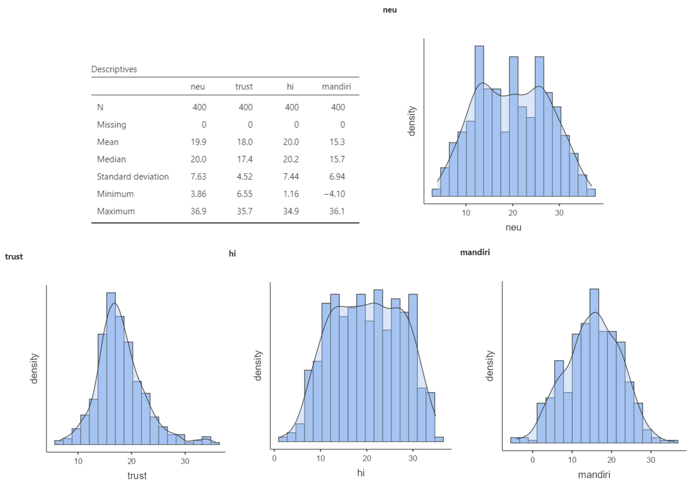{fig-align="center"}

## Membuat _scatterplot_

:::: {.columns}
::: {.column width="60%"}

* Merupakan teknik inspeksi visual kemungkinan terjadinya korelasi antara variabel.
* Setelah melakukan analisis deskriptif, sepertinya akan menarik membandingkan kaitan antara:
  - _Neuroticism_ (neu) dengan tingkat kemandirian (mandiri)
  - Kepercayaan ibu bahwa anak dapat berkembang secara natural (_trust_) dengan tingkat kemandirian (mandiri)
* Ayo kita buat _scatterplot_!
  - Klik **exploration**, pilih **scatterplot**
  - Masukkan **mandiri** pada kolom **Y-axis**
  - Masukkan **neu** (scatterplot 1) dan **trust** (scatterplot 2) pada **kolom X-axis**
  - Pada opsi **regression line**, pilih **linear** dan centang kotak **confidence interval**

:::
::: {.column width="40%"}

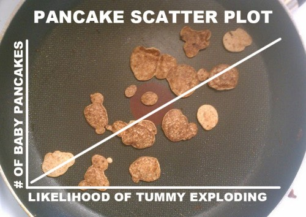{fig-align="center"}

:::
::::

## _Scatterplot_

:::: {.columns}
::: {.column width="50%"}

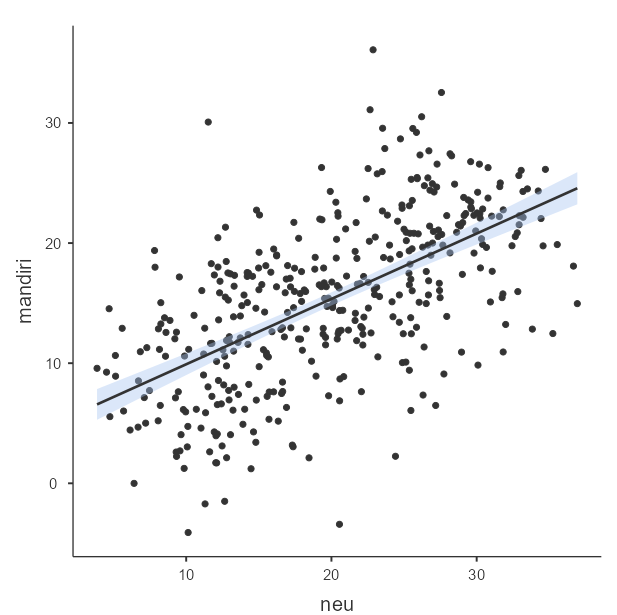{fig-align="center"}

<em>Scatterplot</em> 1. <em>Neuroticism</em> dan Kemandirian

:::
::: {.column width="50%"}

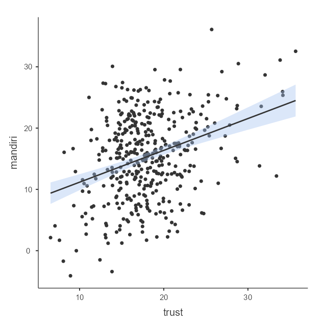{fig-align="center"}

<em>Scatterplot</em> 2. <em>Trust</em> dan Kemandirian

:::
::::

::: {.footnote}
**Bagaimana kekuatan dan arah hubungan pada _scatterplot_ 1 dan 2?**
:::

## Menebak Korelasi 📢

:::: {.columns}
::: {.column width="50%"}

### 🔗 [**Guess the correlation**](http://guessthecorrelation.com/) 🔗

:::
::: {.column width="50%"}

{fig-align="center"}

:::
::::

## Kekuatan dan arah korelasi 1️⃣

::: {.incremental}

Korelasi yang tampak pada _scatterplot_ tadi dapat dikonseptualisasikan dengan lebih jelas dengan menghitung **koefisien korelasi**, yang mengimplikasikan kekuatan hubungan.

* _Pearson's_ r misalnya, biasanya ditulis dengan _r_~xy~, sedangkan _Spearman's_ ρ ditulis _r_~s~.
* Berkisar antara -1 s/d 1
* -1 artinya korelasi negatif sempurna, 1 artinya korelasi positif sempurna
* Koefisien korelasi _Pearson's_ _r_ dihitung dari kovarians (_covariance_/_average cross product_) dari dua variabel, sedangkan _Spearman's_ ρ dihitung dari kovarians **peringkat** (_rank_) kedua variabel — bukan nilai aslinya
  - Dua variabel yang sama sekali tak berkorelasi, maka kovarians nol

:::

## Kekuatan dan arah korelasi 2️⃣

:::: {.columns}
::: {.column width="55%"}

* Kovarians sulit diinterpretasi, sehingga formula _Pearson's_ r dan _Spearman's_ ρ menstandardisasi kovarians agar lebih mudah diinterpretasi
* Fungsi _Pearson's r_ dan _Spearman's_ ρ mirip _z-score_
* Kuat >< lemahnya koefisien korelasi sebenarnya sangat tergantung konteks penelitiannya.
  - Pada fenomena yang multifaktor, misalnya mencari variabel yang berkaitan dengan kecenderungan Skizofrenia, korelasi 0.3 aja sudah bermakna sangat besar.

:::
::: {.column width="45%"}

{fig-align="center" width="80%"}

:::
::::

## Regresi linear

:::: {.columns}
::: {.column width="60%"}
::: {.incremental}

* Merupakan kelanjutan yang lebih kompleks dari _Pearson's_ r
* Ide dasarnya adalah menyusun persamaan garis yang dapat digunakan untuk **memperkirakan** nilai Y ketika nilai X diketahui
  - Contohnya, kita memiliki hipotesis bahwa **kemandirian** berkorelasi positif dan sedang dengan **neuroticism** dan **trust** dan memang menemukan korelasi antara keduanya
  - Namun dengan regresi, kita bisa _mengestimasi_ tingkat kemandirian anak, ketika hanya informasi mengenai _neuroticism_ dan _trust_ yang tersedia.
* OLS bekerja dengan pendekatan _least square_, artinya mencari **jumlah kuadrat terkecil** antara garis regresi (nilai Y yang diperkirakan oleh model) dengan nilai Y yang diobservasi.

:::
:::
::: {.column width="40%"}

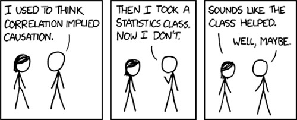{fig-align="center"}

:::
::::

## Persamaan garis regresi

{fig-align="center"}

## Contoh garis regresi

{fig-align="center"}

## Asumsi yang harus dipenuhi

::: {.incremental}

* Prediktor dan variabel dependen **berkorelasi secara linear**
  - Lakukan analisis korelasi sebelum melakukan regresi untuk memastikan asumsi ini terpenuhi
* Residual (varians _error_) variabel dependen yang tidak dapat dijelaskan oleh model
  - Berdistribusi normal
  - Variansnya homogen (**homoskedastisitas**)
  - Tidak dipengaruhi oleh prediktor lain diluar model
* Prediktor dalam model independen satu sama lain (tidak berkorelasi)
  - Berlaku ketika ada dua atau lebih prediktor dalam satu model regresi
  - Kalau prediktor berkorelasi satu sama lain maka telah terjadi **multi-kolinearitas**
* **Data/observasi dan residual harus independen**

:::

## Latihan 1️⃣

Marimar ingin tahu apakah ada kaitan antara kecenderungan _neuroticism_ ibu terhadap kemandirian anak.

* Klik menu **regression**, pilih **linear regression**.
* Masukkan **mandiri** dalam kolom **dependent variable** dan **neu** pada **covariates**.
* Pada opsi **assumption checks**, centang **Q-Q plot of residuals**, **residual plots** dan **Cook's distance**.
* Pada opsi **model fit**, centang **R**, **R^2^**, **Adjusted R^2^** dan **F test**.
* Pada opsi **model coefficients**, centang **ANOVA test**, **confidence interval**, dan **standardized estimates**.

## _Model fit_

:::: {.columns}
::: {.column}

* Model regresi kita cukup baik menggambarkan tren pada data (_F_(1,398) = 221, _p_ = .001).
* Namun model hanya mampu menjelaskan 35.7% varians kemandirian anak (R^2^ = .357).
  - Gunakan _adjusted_ R^2^ apabila ada lebih dari 1 prediktor dalam model.
  - _Adjusted_ R^2^ dapat mengurangi bias R^2^ karena memberikan pinalti pada jumlah prediktor ➡️ semakin banyak prediktor, makin besar pinalti.

:::
::: {.column width="45%"}

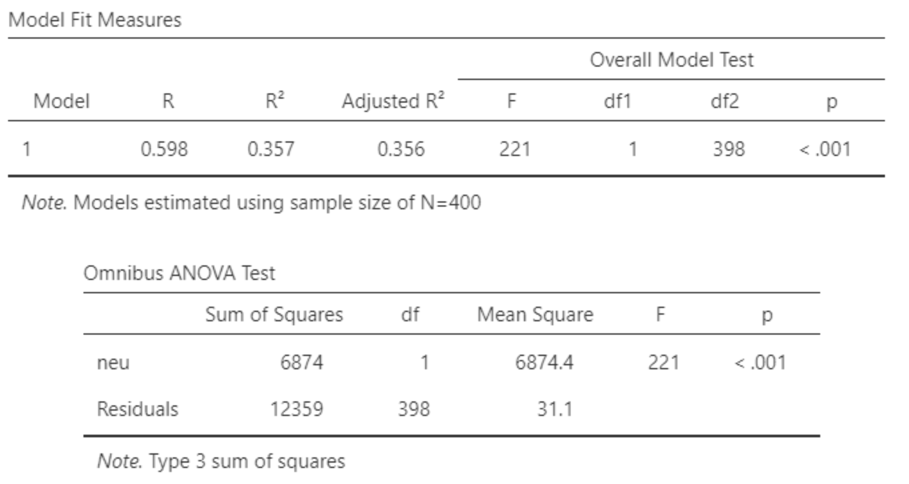{fig-align="center" width="150%"}

:::
::::

## Model fit

:::: {.columns}
::: {.column}

* Coba bandingkan _sum of squares_ antara **neu** dengan **Residuals** (tabel ANOVA).
* Manakah yang lebih banyak; varians yang **dapat**, atau yang **tidak dapat dijelaskan** oleh model?

:::
::: {.column}

{fig-align="center" width="120%"}

:::
::::

::: {.callout-note}
#### Statistical grand prize 🎁🎁🎁
Hampir semua teknik statistik intinya adalah membandingkan varians variabel _outcome_ yang dapat dengan yang tidak dapat dijelaskan (residual) oleh model
:::

## Koefisien model

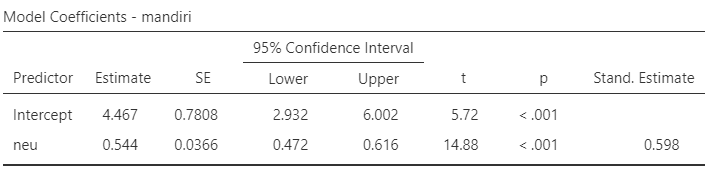{fig-align="center"}

#### Kecenderungan _neuroticism_ ibu dapat menjelaskan variasi kemandirian anak (_B_ = 0.544 95% CI [0.472, 0.616], _SE_ = 0.036, _t_ = 14.88, _p_ = .001).

#### Interpretasi _standardized_ (_β_) dan _unstandardized_ (_B_) _estimates_

* _Unstandardized_ (_B_) _estimates_: Setiap perubahan _neuroticism_ sebesar 1 poin, maka tingkat kemandirian juga berubah sebesar 0.544 poin.
* _Standardized_ (_β_) _estimates_: Setiap perubahan _neuroticism_ sebesar 1SD, maka tingkat kemandirian juga berubah sebesar 0.598SD.

::: {.callout-tip}
#### Tips 
Selalu laporkan _unstandardized estimates_ dan _confidence interval_ ([Appelbaum et al., 2018](http://dx.doi.org/10.1037/amp0000191)).
:::

## Diagnostik model: distribusi residual

:::: {.columns}
::: {.column}

* Salah satu asumsi penting yang harus dipenuhi ketika melakukan regresi OLS adalah **residual (bukan data)** harus berdistribusi normal.
* Sebaran residual mengikuti garis diagonal dalam Q-Q Plot, tandanya residual berdistribusi normal.
* Apabila residual tersebar secara acak atau makin menjauhi garis diagonal, berarti tidak berdistribusi normal dan ini melanggar asumsi _ordinary least square_.
* Akibatnya, model tak dapat diinterpretasi dan koefisien model (_intercept_ dan _slope_) bias.

:::
::: {.column}

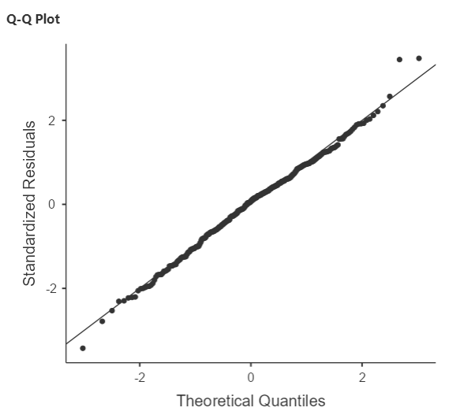{fig-align="center" width="80%"}

:::
::::

## Diagnostik model: varians residual 1️⃣

:::: {.columns}
::: {.column}

* Asumsi lain yang harus dipenuhi adalah **homoskedastisitas**.
* Residual memenuhi asumsi homoskedastisitas, apabila variansnya **uniform (sama)** meskipun _fitted_ Y (nilai Y yang diestimasi oleh model, plot kanan atas) dan nilai X (plot kanan bawah) berubah-ubah.
  - Hal ini ditunjukkan dari dua plot disamping yang menunjukkan distribusi **varians residual uniform**.
* Apabila asumsi ini dilanggar, maka residual mengalami **heteroskedastisitas**, dengan begitu, estimasi model akan bias.
* Kalau residual menunjukkan karakteristik **hetero**skedastik, maka distribusi residual akan terlihat seperti kerucut.

:::
::: {.column}

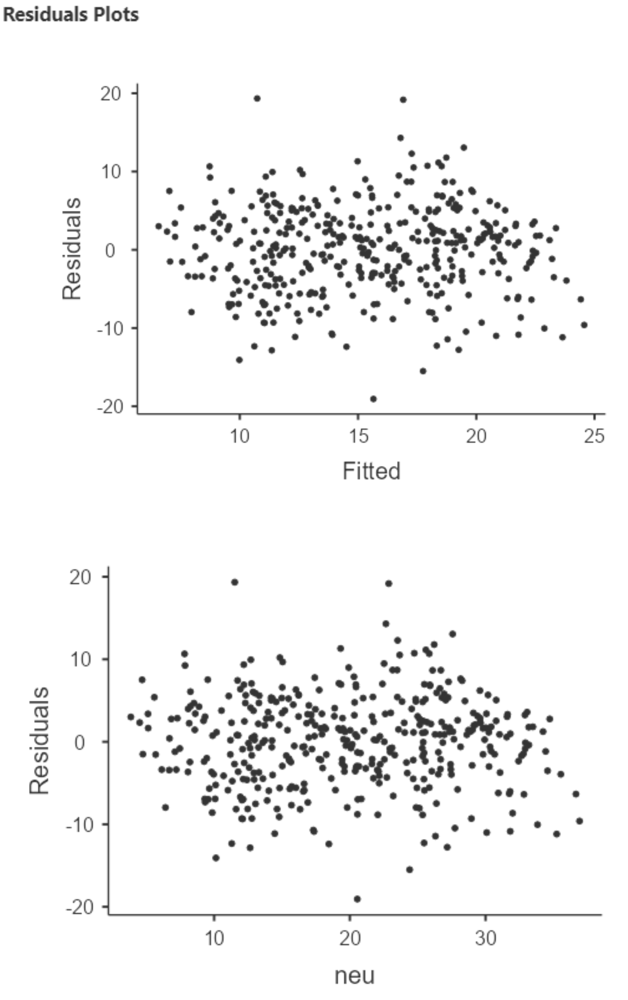{fig-align="center" width="70%"}

:::
::::

## Diagnostik model: varians residual 2️⃣

:::: {.columns}
::: {.column width="55%"}

* Plot disamping kanan menunjukkan kondisi **heteroskedastik**
* Contoh heteroskedastisitas: pendapatan personal dan usia
  - Pada usia **anak-anak, remaja dan dewasa awal**, variasi tingkat pendapatan sangat kecil, sedangkan yang **usianya lebih tua**, variasi tingkat pendapatan **lebih besar**.
  - Apa kira-kira alasannya?

:::
::: {.column width="45%"}

{fig-align="center"}

:::
::::

## Diagnostik model: deteksi _outliers_ 1️⃣

:::: {.columns}
::: {.column width="55%"}

* Gerak-gerik data _outlier_ penting untuk diperhatikan.
  - Seperti grafik di sebelah kanan, penambahan data _outlier_ dapat merubah garis regresi secara drastis.
* Untuk melihat seberapa 'mengkhawatirkan' data _outlier_ ini dalam mengganggu garis regresi, kita dapat menggunakan _Cook's distance_.
* Umumnya, apabila _outlier_ dibuang dan perubahan rata-rata, median, dan standar deviasi kurang dari 1, dapat diabaikan. 
* Artinya _outlier_ tersebut tidak terlalu mengganggu garis regresi.

:::
::: {.column width="45%"}

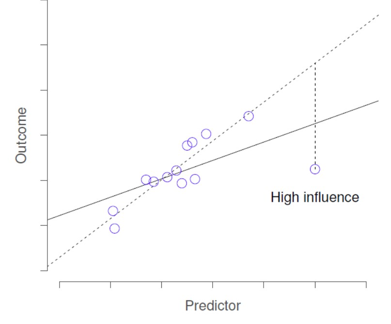{fig-align="center"}

:::
::::

## Diagnostik model: deteksi _outliers_ 2️⃣

::: {.incremental}

* Kalau _Cook's distance_ diatas 1 bagaimana?
  - Coba buat lagi garis regresi tanpa _outlier_ tersebut, cari tahu kenapa nilainya bisa se-ekstrim itu
  - _Outlier_ umumnya tidak boleh dihapus dari dataset tanpa justifikasi yang jelas, karena ini termasuk [_questionable research practices_](https://pmc.ncbi.nlm.nih.gov/articles/PMC4114807/).
  - Kalau sangat mendesak, _outlier_ dapat dikeluarkan dari model. Tetapi ini tidak disarankan dan kalaupun dilakukan, analisis **harus dilaporkan dua versi; dengan dan tanpa _outlier_.**
  - Daripada dihapus, sebaiknya pakai regresi dengan [_robust estimator_](https://forum.jamovi.org/viewtopic.php?t=4067) yang dapat mengurangi efek _outlier_.

:::

## Diagnostik model: deteksi _outliers_ 3️⃣ 

:::: {.columns}
::: {.column}

* Dari _output_ di samping, dapat disimpulkan bahwa apabila _outlier_ tidak disertakan dalam analisis, maka perubahan rerata, median, dan standar deviasi keseluruhan sampel kurang dari 1 dari nilai asalnya.

:::
::: {.column}

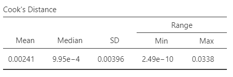{fig-align="center" width="150%"}

:::
::::

## Cara melaporkannya dalam manuskrip 1️⃣

> Untuk menguji hipotesis penelitian, peneliti melakukan analisis regresi _ordinary least square_ (OLS). Hasil analisis menunjukkan bahwa model cocok menggambarkan data dan mampu menjelaskan kurang dari 40% varians tingkat kemandirian siswa (_F_(1,398) = 221, _p_ = .001, _R_^2^ = .357).
> Kecenderungan _neuroticism_ ibu berkontribusi berarti dalam menjelaskan varians tingkat kemandirian siswa, dimana perubahan kecenderungan _neuroticism_ sebesar 1 poin diasosiasikan dengan perubahan tingkat kemandirian anak sebesar 0.544 (_B_ = 0.544 95% CI [0.472, 0.616], _SE_ = 0.036, _t_ = 14.88, _p_ = .001). Berbeda dengan yang dihipotesiskan sebelumnya, ibu dengan tingkat _neuroticism_ yang tinggi justru mengasuh anak dengan tingkat kemandirian yang juga tinggi.
> Setelah dilakukan diagnostik, varians yang tidak dapat dijelaskan oleh model berdistribusi normal dan ketika dikorelasikan dengan nilai prediktif tingkat kemandirian siswa dan kecenderungan _neuroticism_ ibu, maka menghasilkan varians yang homogen (homoskedastik).

## Cara melaporkannya dalam manuskrip 2️⃣

> Diagnostik _outlier_ dilakukan dengan menggunakan _Cook's distance_, dan menghasilkan kesimpulan bahwa apabila _outlier_ tidak disertakan dalam model, maka perubahan rerata, nilai tengah, dan simpangan baku kurang dari satu dari nilai awalnya, sehingga tidak berpotensi mendistorsi garis regresi.

## Ada pertanyaan❓

{fig-align="center"}

::: {.callout-note}
* Paparan disusun dengan menggunakan <i class="fa-brands fa-r-project"></i> dan [**Quarto**](https://quarto.org) dengan _template_ dari [UNAIR Theme](https://github.com/rameliaz/quarto-unair-theme).
* Kontak saya via <i class="fas fa-paper-plane"></i> <a href="mailto:amelia.zein@psikologi.unair.ac.id">amelia.zein@psikologi.unair.ac.id</a>
:::
